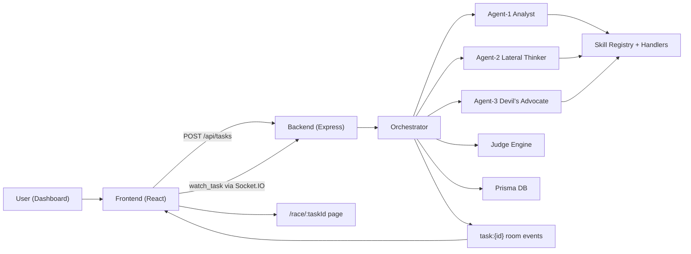

# Agent Strategy Lab: Infrastructure and System Guide

Last updated: February 25, 2026

## 1) Problem Statement

Most AI products return a single answer with little trust and no measurable strategy data.

Common pain points:
- You cannot tell which model or strategy is actually better.
- You cannot see why an answer won.
- Tool usage is often opaque and non-persistent.
- Teams cannot route future tasks to the best agent configuration with evidence.

This project solves that by running a transparent multi-agent race, scoring outputs with a judge, and persisting strategy and tool telemetry for learning and routing.

## 2) What This System Is

Agent Strategy Lab is a multi-agent evaluation and routing engine with:
- 3 competing personas solving the same task.
- Shared skill system with per-race toggles.
- Judge scoring (single or consensus) with evidence and weighted criteria.
- Persistence of runs, scores, telemetry, and transferable patterns.
- Shareable result pages for each race (`/race/:taskId`).

## 3) High-Level Architecture

### Core Components
- Frontend (React + Vite + Tailwind): race UI, live reasoning stream, history, share pages.
- Backend (Express + Socket.IO + TypeScript): orchestration, providers, skills, judge, persistence.
- Database (Prisma + SQLite in current code): tasks, results, judge outputs, skill usage, learning.
- Cache (in-memory map): short-lived result snapshots.
- LLM providers: Anthropic and Gemini.
 - LLM providers: Anthropic, Gemini, and OpenAI.

### Runtime Flow


## 4) Backend Infrastructure

### Server and Middleware
- Entry: `backend/src/index.ts`
- Security: `helmet`, rate limits, CORS, optional basic auth.
- Request tracing: `x-request-id`.
- Logging: morgan -> winston logger.
- WebSocket rooms: clients join `task:${taskId}` via `watch_task`.

### Routing
- `POST /api/tasks` and task reads: `backend/src/routes/tasks.ts`
- Agent stats: `backend/src/routes/agents.ts`
- Strategies and patterns: `backend/src/routes/strategies.ts`
- Skills list/usage/install/update: `backend/src/routes/skills.ts`
- Provider/system status: `backend/src/routes/system.ts`

### Orchestration Engine
- File: `backend/src/orchestrator.ts`
- Key responsibilities:
  - Resolve domain plan (category -> default skills/judge policy/objective mode).
  - Start race and emit lifecycle updates.
  - Run all agents concurrently.
  - Trigger judge (single or consensus).
  - Apply objective scoring adjustments for coding domains before diversity penalty.
  - Apply diversity penalty.
  - Persist results, judge output, skill usage, telemetry.
  - Compute category baseline and winner lift.
  - Update transfer learning records.

## 5) Frontend Infrastructure

### App and Pages
- Router: `frontend/src/App.tsx`
- Main pages:
  - `/` -> Dashboard race execution
  - `/strategies` -> History and transferable patterns
  - `/race/:taskId` -> Shareable detailed result view

### Live Updates
- Dashboard opens Socket.IO to backend.
- Watches current task room (`watch_task`).
- Receives streamed events:
  - `orchestration_started`
  - `reasoning_step`
  - `agent_complete`
  - `judging_started`
  - `orchestration_complete`

## 6) Data Model (Prisma)

Source: `backend/prisma/schema.prisma`

Main models:
- `Task`: prompt, status, category, timestamps.
- `TaskResult`: per-agent output, reasoning, telemetry, token/time metrics.
- `JudgeResult`: winner, summary, criteria weights, prompt version, judge runs, scores.
- `SkillUsage`: per-call logs (`skillName`, success, duration, `turnIndex`, `callIndex`).
- `Strategy`: winner strategy snapshots for tasks.
- `AgentLearning`: cross-agent learned patterns and lift statistics.
- `LearningObservation`: per-agent `win_pattern`/`loss_pattern` observations with score/tool/reasoning payloads.

## 7) Skill System

### Current Skills
Folder: `backend/skills/*`
- `web-search`
- `code-executor`
- `calculator`
- `file-reader`
- `workspace-shell` (safe command execution for coding workflows)

`web-search` provider order:
- Tavily (primary, recommended)
- Serper (secondary)
- DuckDuckGo HTML fallback

### Skill Discovery, Precedence, and Gating
File: `backend/src/skills/registry.ts`

Precedence:
- `workspace` > `managed` > `bundled`

Roots:
- `AGENT_LAB_WORKSPACE_SKILLS_DIR` (or default workspace path)
- `AGENT_LAB_MANAGED_SKILLS_DIR` (or `~/.agent-lab/skills`)
- `AGENT_LAB_BUNDLED_SKILLS_DIR` (or backend bundled path)

Load-time metadata gating:
- `metadata.openclaw.requires.bins`
- `metadata.openclaw.requires.anyBins`
- `metadata.openclaw.requires.env`
- `metadata.openclaw.requires.os`

### Skill Management APIs
- `GET /api/skills`
- `GET /api/skills?includeIneligible=true`
- `GET /api/skills/usage`
- `POST /api/skills/install`
- `POST /api/skills/update`

### Safety Note for `workspace-shell`
`workspace-shell` is allowlisted and restricted:
- Commands allowed: `rg`, `ls`, `cat`, `sed`, `head`, `tail`, `wc`, `git`, `npm`, `pnpm`, `yarn`
- Git subcommands restricted to safe read/inspect operations.
- Package commands restricted to safe scripts (`build`, `test`, `lint`, etc).
- `cwd` enforced inside workspace roots.
- Timeouts and output truncation applied.

## 8) Agent Runtime

File: `backend/src/agent-runner.ts`

Each race runs:
- `agent-1` The Analyst
- `agent-2` The Lateral Thinker
- `agent-3` The Devil's Advocate

Execution pattern:
- Build persona system prompt + active skill prompt block.
- Multi-turn loop with tool calls.
- Record reasoning steps and tool telemetry.
- Return structured `AgentRunResult`.

Telemetry captured:
- Total tool calls
- Successful tool calls
- Verification step count
- First tool and first tool turn
- Tool sequence

## 9) Judge System

File: `backend/src/judge.ts`

Scoring metrics:
- Accuracy
- Completeness
- Clarity
- Insight

Weighted total:
- Normalized to `/40`.
- Default weights: `0.3, 0.3, 0.2, 0.2`.

Domain-aware scoring:
- Domain router can override default weights by task domain.
- Coding domain enables `objectiveMode: coding-v1`, which blends LLM judge metrics with executable verification signals from tool telemetry.

Modes:
- `single`: one judge pass.
- `consensus`: 3 judge panels, median metric aggregation.

Trust features:
- Prompt versioning (`judge-v2` default).
- Per-metric evidence snippets (`quote`, `reason`).
- Objective coding adjustment payload (`objectiveAdjustment`) with verification/test/lint deltas and notes.
- Diversity penalty:
  - Similarity threshold: `0.72`
  - Penalty factor: `0.8` on base total

Fallback behavior:
- If judge parse/provider fails, fallback scoring is applied instead of crashing the race pipeline.

## 10) Learning Engine

Implemented in `backend/src/orchestrator.ts`.

Mechanism:
- Only learns from sufficiently strong winners (`>= 25/40`).
- Extracts high-confidence reasoning/tool-path pattern.
- Transfers to other agents as `AgentLearning`.
- Tracks `avgLift`, `liftSamples`, `successRate`.

Lift calculation:
- Baseline is category-specific historical winner average.
- `winnerLift = winnerScore - baseline`.

Task categories:
- `coding`, `finance`, `math`, `research`, `analysis`, `creative`, `general`
- Classifier in `backend/src/task-category.ts`.
- Domain routing profiles in `backend/src/domain-router.ts`.

## 11) API Contracts (Summary)

### System
- `GET /health`: service health.
- `GET /api/system/status`: provider readiness, default models, judge defaults, skill roots, and domain profile defaults.

Confidence gate controls (backend env):
- `CONFIDENCE_GATE_ENABLED`
- `CONFIDENCE_GATE_MIN_TOTAL`
- `CONFIDENCE_GATE_MIN_MARGIN`
- `CONFIDENCE_GATE_MIN_ACCURACY`

### Tasks
- `POST /api/tasks`
  - Body supports:
    - `prompt` (required)
    - `skills` string[]
    - `provider` (`anthropic|gemini`)
    - `model`
    - `judgeMode` (`single|consensus`)
    - `criteriaWeights`
    - `replay` object (optional) for Agent Memory Replay:
      - `sourceTaskId`
      - `sourceStrategyId`
      - `sourceAgentId`
      - `sourcePersona`
      - `toolSequence[]`
      - `reasoningPath[]`
  - Returns: `taskId`, async queued status.
- `GET /api/tasks/:id`: full task detail with results, judge payload, skill usage.
- `GET /api/tasks?limit=&status=`: task list.

### Agents
- `GET /api/agents`
- `GET /api/agents/:id`

### Strategies
- `GET /api/strategies`
- `GET /api/strategies/agent/:id`
- `GET /api/strategies/patterns?limit=&category=`

### Skills
- `GET /api/skills`
- `GET /api/skills/usage`
- `POST /api/skills/install`
- `POST /api/skills/update`

## 12) WebSocket Contract

Namespace: default Socket.IO namespace on backend.

Client event:
- `watch_task(taskId)` -> joins room `task:${taskId}`

Server events (inside room):
- `task_update` payload with `type`:
  - `orchestration_started`
  - `reasoning_step`
  - `agent_complete`
  - `judging_started`
  - `orchestration_complete`

Important fix:
- Updates are room-scoped (`io.to(task:${taskId})`) to avoid cross-user leakage.

## 13) Engineering Tricks Used

1. Room-scoped Socket.IO updates to isolate tasks by viewer.
2. Persona behavior contracts (not only style differences).
3. Multi-turn tool use loops for both Anthropic and Gemini.
4. Skill telemetry sequencing (`turnIndex`, `callIndex`) for strategy analytics.
5. Judge evidence extraction and range localization in response text.
6. Diversity penalty to discourage near-identical agent reasoning.
7. Consensus judging with median aggregation for outlier resistance.
8. Category-based baseline + lift to quantify strategy improvement.
9. Skill precedence with managed overrides for controlled rollout.
10. Graceful fallback scoring to avoid full-pipeline failure on judge parse errors.
11. Failure observation capture so low-score/failed runs are preserved as `loss_pattern` data.
12. Agent Memory Replay: prior winner strategy context can be injected into new runs for transfer validation.

## 14) Problems and How They Were Solved

| Problem | Impact | Solution Implemented |
|---|---|---|
| WebSocket broadcast leaked updates across users | Privacy and UX issue | Switched to room-scoped emits per task ID |
| Judge results not durable | High-value evaluation data loss | Added `JudgeResult` persistence in DB |
| Skill usage not persisted | No longitudinal tool analytics | Added `SkillUsage` model and writes |
| Winner-only learning gate discarded weak runs | Biased learning signal | Added `LearningObservation` capture for `loss_pattern` and `win_pattern` |
| Skill toggles missing in UI | No per-race tool control | Added dashboard skill selection and API binding |
| Judge subjectivity concern | Low trust in winner | Added weighted criteria, prompt versioning, evidence, consensus mode |
| Persona collapse risk | Race quality felt arbitrary | Added behavior contracts and diversity penalty |
| Learning lacked measurable ROI | No proof of improvement | Added category baseline and lift tracking |
| No managed skill lifecycle | Hard to evolve skills safely | Added install/update endpoints + precedence model |
| API key confusion and failed runs | Frequent user friction | Added provider readiness endpoint and explicit reasons |

## 15) Known Gaps / Risks

1. Docker compose currently configures Postgres/Redis, but Prisma schema is set to SQLite provider.
2. LLM provider quota/key issues can mark races as failed when all agents error.
3. Test coverage for end-to-end race and judge consensus behavior can be expanded.
4. `workspace-shell` can fail `git` commands in non-git directories, which is expected but should be explained in UX.

## 16) Troubleshooting Runbook

### Race status = failed
- Check `/api/system/status` provider readiness.
- Check backend logs for:
  - Gemini `429` quota errors
  - Anthropic `401 invalid x-api-key`

### Skills missing from dashboard
- Check `GET /api/skills`.
- If skill is gated out, use `?includeIneligible=true` to inspect `disabledReasons`.

### Cross-origin or no live updates
- Confirm frontend URL matches `CORS_ORIGIN`.
- Confirm websocket `watch_task` is emitted and backend room joins are logged.

### `workspace-shell` denied command
- Command or subcommand is outside allowlist.
- Use allowed command forms or extend policy in skill handler.

### `workspace-shell` git errors
- `git status` requires a git repository in current `cwd`.
- Set `cwd` to a repo path or use non-git inspect commands.

## 17) Extension Guide

### Add a new skill
1. Create `backend/skills/<skill-name>/SKILL.md`.
2. Add `handler.ts` with `inputSchema` and `handler`.
3. Register handler in `backend/src/skills/registry.ts` `HANDLER_MAP`.
4. Optional: add icon mapping in frontend dashboard.

### Add a new provider
1. Extend `SUPPORTED_PROVIDERS` and provider status in `backend/src/llm/provider.ts`.
2. Implement request flow in `agent-runner.ts`.
3. Implement judge request flow in `judge.ts`.
4. Surface model/provider defaults in `/api/system/status`.

### Add new judge metric
1. Extend `JudgeWeights`, `JudgeScore`, and validation schema in `judge.ts`.
2. Update weighted total math.
3. Update frontend score rendering on Dashboard and RaceResult pages.

## 18) Quick Local Commands

Backend:
```bash
cd "/Users/borheneddinesaidi/Documents/plan test/backend"
npm run dev
```

Frontend:
```bash
cd "/Users/borheneddinesaidi/Documents/plan test/frontend"
npm run dev
```

Production builds:
```bash
cd "/Users/borheneddinesaidi/Documents/plan test/backend" && npm run build
cd "/Users/borheneddinesaidi/Documents/plan test/frontend" && npm run build
```
