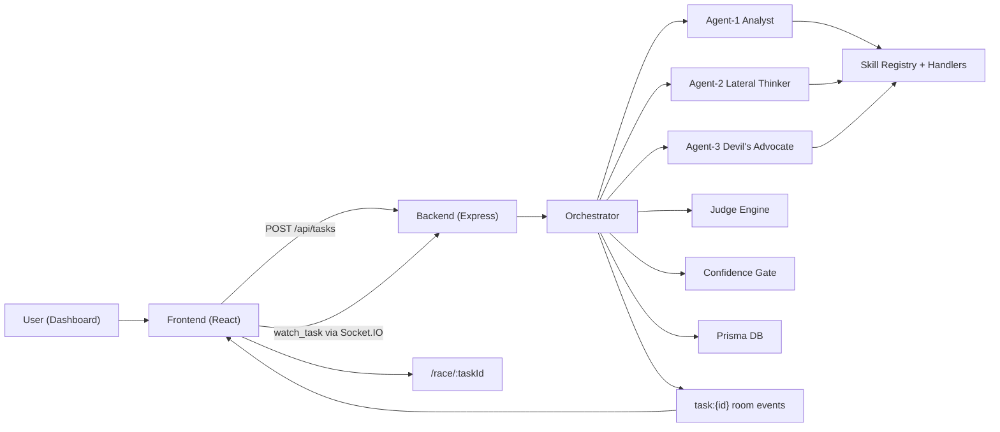

# Agent Strategy Lab

Transparent multi-agent evaluation and routing engine for coding, finance, and research workflows.

## Why This Exists

Most LLM apps return one answer with weak trust signals.

That creates 3 problems for real teams:
- You cannot prove which strategy/model is better.
- You cannot see why a winner was selected.
- You cannot reuse winning behavior with measurable lift.

Agent Strategy Lab solves this by running multiple agents in parallel, scoring with evidence, gating low-confidence winners, and persisting strategy telemetry.

## Architecture



## Demo

UI preview:


Run locally:
- Frontend: `http://localhost:5173`
- Backend API: `http://localhost:3000`

## What Is Novel Here

### 1) Evidence-backed judging, not vibes
- Judge scores `accuracy/completeness/clarity/insight` with per-metric evidence snippets.
- Consensus mode uses 3 judge panels and median aggregation.

### 2) Confidence gate before trust
- Low-confidence winners are explicitly flagged.
- Learning updates are skipped when confidence fails, reducing bad pattern propagation.

### 3) Learning engine with lift tracking
- Stores `win_pattern` and `loss_pattern` observations.
- Tracks category-aware baseline and winner lift.

### 4) Multi-agent skill telemetry
- Full tool sequence is persisted (`turnIndex`, `callIndex`, success, duration).
- Skills can be toggled per race.

## Measurable System Numbers

These are current runtime defaults and scoring constants:

| Metric | Value |
|---|---|
| Agents per race | 3 |
| Judge metrics | 4 (`accuracy`, `completeness`, `clarity`, `insight`) |
| Score scale | `/40` |
| Consensus panels | 3 |
| Agent max turns | 8 |
| Diversity threshold | `0.72` |
| Diversity penalty factor | `0.8` |
| Confidence gate min total | `26/40` |
| Confidence gate min margin | `2.0` |
| Confidence gate min accuracy | `6.5/10` |
| Domain categories | 7 (`coding`, `finance`, `math`, `research`, `analysis`, `creative`, `general`) |
| Local history snapshot (2026-02-25) | 36 tasks, 9 completed, 9 judge verdicts |

Local sample run snapshot (from `JudgeResult`, task `cmm26zhsq0001bogg6x9b6g9t`):

| Agent | Total |
|---|---|
| agent-1 | 29 |
| agent-2 | 33 |
| agent-3 | 35 (winner) |

## Skills

- `web-search` (Tavily -> Serper -> DuckDuckGo fallback)
- `file-reader`
- `calculator`
- `code-executor`
- `workspace-shell`

## Tech Stack

- Backend: Node.js, TypeScript, Express, Socket.IO, Prisma
- Frontend: React, TypeScript, Vite, Tailwind
- DB: SQLite (default) via Prisma
- Providers: Anthropic, Gemini, OpenAI

## Quick Start

### 1) Prerequisites

- Node.js 18+
- npm 9+

### 2) Install

```bash
cd backend
npm install
npx prisma generate
npx prisma db push

cd ../frontend
npm install
```

### 3) Configure environment

```bash
cd backend
cp .env.example .env
```

Minimum for LLM calls:
- `ANTHROPIC_API_KEY` or `GEMINI_API_KEY` or `OPENAI_API_KEY`

Recommended for reliable search:
- `TAVILY_API_KEY`
- `SERPER_API_KEY`

### 4) Run dev

Terminal A:
```bash
cd backend
npm run dev
```

Terminal B:
```bash
cd frontend
npm run dev
```

Open `http://localhost:5173`.

## Project Docs

- Architecture + infra: `PROJECT_INFRASTRUCTURE_GUIDE.md`
- Full implementation log: `TECHNICAL_IMPLEMENTATION_LOG.md`
- Agent boundaries: `AGENTS.md`
- OSS release checklist: `OPEN_SOURCE_RELEASE_CHECKLIST.md`

## Contributing

See [CONTRIBUTING.md](CONTRIBUTING.md).

## Security

See [SECURITY.md](SECURITY.md).

## License

MIT - see [LICENSE](LICENSE).
